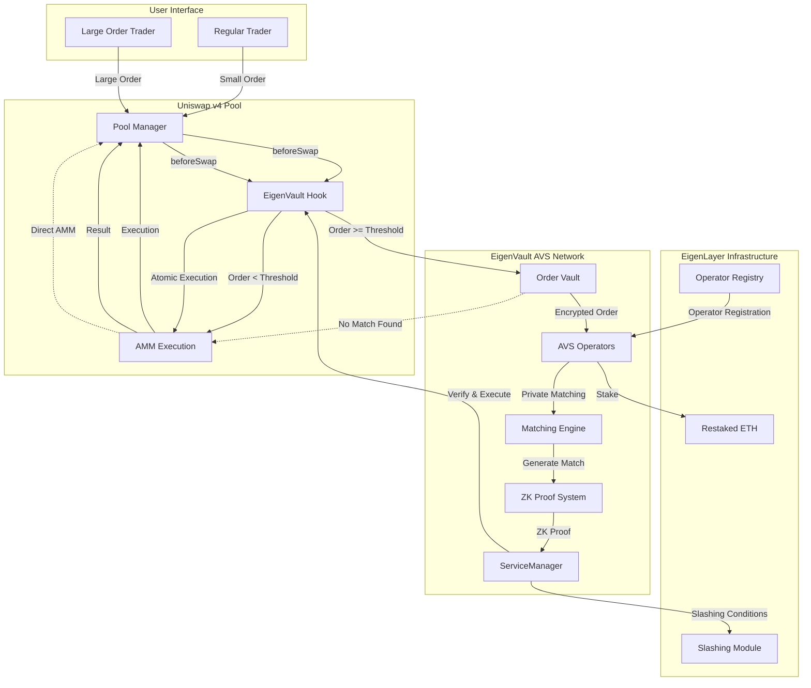

# EigenVault 🔐

> **Uniswap v4 Hookathon (UHI6) Submission - EigenLayer Benefactor Track**

A privacy-preserving trading infrastructure that combines Uniswap v4 Hooks with EigenLayer's Actively Validated Services (AVS) to enable institutional-grade dark pool functionality on DEXs. EigenVault securely stores and privately matches large orders before execution.

## 🎯 Problem Statement

Traditional AMMs suffer from several critical issues for institutional traders:

- **MEV Exploitation**: Large orders are frontrun by MEV bots
- **Information Leakage**: All orders are visible in the mempool before execution  
- **Price Impact**: Large trades cause significant slippage and market disruption
- **Lack of Privacy**: Trading strategies are exposed to competitors
- **Poor Price Discovery**: Inefficient matching leads to suboptimal execution

## 💡 Solution: EigenLayer-Secured Dark Pool

Our solution combines the transparency of Uniswap v4 with the privacy guarantees of a traditional dark pool, secured by EigenLayer's cryptoeconomic security model. EigenVault acts as a secure vault for large orders, protecting them from MEV while enabling efficient price discovery.

### Key Innovation
- **Private Order Matching**: Orders are matched off-chain by AVS operators before hitting the AMM
- **Cryptoeconomic Security**: EigenLayer restakers secure the matching process through slashing conditions
- **MEV Protection**: Orders are bundled and executed atomically, eliminating frontrunning
- **Institutional-Grade Privacy**: Zero-knowledge proofs ensure order privacy until execution

## 🏗️ Architecture

### Hook Flow Diagram



### Components Overview

```
┌─────────────────┐    ┌──────────────────┐    ┌─────────────────┐
│   Uniswap v4    │    │  EigenVault AVS  │    │   EigenLayer    │
│      Hook       │◄──►│    Operators     │◄──►│   Restakers     │
└─────────────────┘    └──────────────────┘    └─────────────────┘
         │                       │                       │
         ▼                       ▼                       ▼
┌─────────────────┐    ┌──────────────────┐    ┌─────────────────┐
│ Order Routing & │    │ Private Matching │    │ Slashing &      │
│ Vault Storage   │    │ & Verification   │    │ Incentives      │
└─────────────────┘    └──────────────────┘    └─────────────────┘
```

## 🔧 Hook Core Components

### 1. **EigenVault Hook Contract** (`EigenVaultHook.sol`)

The core Uniswap v4 hook that orchestrates private order routing and execution.

#### **Key Functions:**
- **`beforeSwap()`**: Intercepts incoming swaps, analyzes order size
- **`routeToVault()`**: Encrypts and routes large orders to AVS operators  
- **`executeVaultOrder()`**: Processes matched orders with atomic execution
- **`fallbackToAMM()`**: Handles unmatched orders via standard AMM

#### **Order Classification Logic:**
```solidity
function isLargeOrder(uint256 amount, PoolKey calldata key) internal view returns (bool) {
    uint256 poolLiquidity = getPoolLiquidity(key);
    uint256 threshold = (poolLiquidity * vaultThresholdBps) / 10000;
    return amount >= threshold; // Default: 1% of pool liquidity
}
```

#### **Privacy Features:**
- **Order Encryption**: Client-side encryption before submission
- **Commitment Schemes**: Orders committed as hashes with time-locks
- **MEV Protection**: Orders invisible in mempool until execution
- **Batch Execution**: Multiple matched orders executed atomically

### 2. **EigenLayer AVS Infrastructure**

#### **ServiceManager Contract** (`EigenVaultServiceManager.sol`)

Central coordination contract managing the AVS network and operator incentives.

#### **Core Responsibilities:**
- **Operator Registration**: Manages AVS operator onboarding and staking requirements
- **Task Distribution**: Distributes order matching tasks to operator quorum
- **Proof Verification**: Validates ZK proofs of successful matches
- **Slashing Enforcement**: Executes penalties for malicious behavior
- **Reward Distribution**: Distributes fees to performing operators

#### **Task Lifecycle:**
```solidity
struct MatchingTask {
    bytes32 orderSetHash;        // Hash of orders to match
    uint256 deadline;            // Execution deadline
    bytes32 quorumBitmask;       // Required operator participation
    uint256 minimumStake;        // Minimum operator stake required
    MatchingStatus status;       // Task status tracking
}
```

#### **Off-chain Operator Software** (`operator/` directory)

Distributed network of operators running private matching algorithms.

#### **Operator Core Modules:**

##### **🔐 Order Vault Module** (`matching/orderbook.rs`)
- **Encrypted Storage**: Securely stores encrypted order details
- **Access Control**: Only authorized operators can decrypt order data
- **Order Lifecycle**: Manages order states from submission to execution
- **Privacy Guarantees**: Orders remain encrypted until matching occurs

##### **🧮 Matching Engine** (`matching/engine.rs`)
- **Private Set Intersection**: Finds matches without revealing unmatched orders
- **Price-Time Priority**: Implements fair matching algorithms
- **Cross-Order Optimization**: Maximizes matching efficiency across order sets
- **Slippage Minimization**: Optimizes execution prices within acceptable bounds

##### **🛡️ Zero-Knowledge Proof System** (`proofs/generator.rs`)
- **Match Validity Proofs**: Proves orders were matched at fair prices
- **Privacy Preservation**: Generates proofs without revealing order details
- **Batch Proof Generation**: Efficiently proves multiple matches simultaneously
- **Verification Interface**: Provides on-chain verifiable proofs

##### **🌐 Peer-to-Peer Network** (`networking/p2p.rs`)
- **Gossip Protocol**: Distributes encrypted orders across operator network
- **Byzantine Fault Tolerance**: Handles up to 1/3 malicious operators
- **Threshold Signatures**: Requires operator consensus for execution
- **Secure Communications**: End-to-end encrypted operator communications

##### **📡 Ethereum Integration** (`ethereum/client.rs`)
- **Event Monitoring**: Listens for new orders and execution requests
- **Contract Interaction**: Submits proofs and executes matched orders
- **Gas Optimization**: Batches transactions for efficient execution
- **Error Handling**: Robust failure recovery and retry mechanisms

### 3. **Security & Privacy Architecture**

#### **Multi-Layer Privacy Protection:**

##### **Client-Side Privacy** (Order Submission)
- **Symmetric Encryption**: Orders encrypted with operator public keys
- **Commitment Hiding**: Order details hidden until matching occurs
- **Nonce Protection**: Prevents replay attacks and order correlation
- **Metadata Scrubbing**: Removes identifying information from orders

##### **Operator Privacy** (Order Processing)
- **Secure Multi-Party Computation**: Operators compute matches without seeing individual orders
- **Threshold Decryption**: Requires multiple operators to decrypt order data
- **Zero-Knowledge Matching**: Proves valid matches without revealing order contents
- **Differential Privacy**: Adds noise to prevent order inference attacks

##### **Execution Privacy** (Order Settlement)
- **Atomic Batch Execution**: All matched orders execute simultaneously
- **MEV Shielding**: Orders invisible to front-runners until execution
- **Price Consistency**: Ensures fair execution prices across matched orders
- **Transaction Bundling**: Prevents individual order identification on-chain

#### **Cryptoeconomic Security Model:**

##### **Slashing Conditions:**
1. **Invalid Matching**: Submitting proofs for impossible price matches (-50% stake)
2. **Order Leakage**: Revealing private order information (-100% stake)  
3. **Front-running**: Using order information for personal gain (-75% stake)
4. **Availability**: Failing to process orders within SLA (-25% stake)
5. **Collusion**: Coordinating with other operators maliciously (-100% stake)

##### **Incentive Alignment:**
- **Performance Rewards**: Higher fees for faster, more accurate matching
- **Stake Requirements**: Minimum 32 ETH stake per operator (via restaking)
- **Reputation System**: Historical performance affects task assignment
- **Long-term Incentives**: Vesting schedules align operators with protocol success

##### **Fault Tolerance:**
- **Operator Redundancy**: Multiple operators process each order set
- **Graceful Degradation**: System continues operating with reduced operator set
- **Automatic Failover**: Seamless switching to backup operators
- **Recovery Mechanisms**: Handles network partitions and operator failures

## 🔧 Technical Implementation

### Smart Contracts

#### EigenVaultHook.sol
```solidity
contract EigenVaultHook is BaseHook {
    struct PrivateOrder {
        address trader;
        bool zeroForOne;
        uint256 amountSpecified;
        bytes32 commitment; // Hash of order details + nonce
        uint256 deadline;
    }
    
    function beforeSwap(
        address sender,
        PoolKey calldata key,
        IPoolManager.SwapParams calldata params,
        bytes calldata hookData
    ) external override returns (bytes4) {
        // Route large orders to AVS for private matching
        if (isLargeOrder(params.amountSpecified)) {
            return routeToAVS(sender, key, params, hookData);
        }
        return BaseHook.beforeSwap.selector;
    }
}
```

#### EigenVaultServiceManager.sol
```solidity
contract EigenVaultServiceManager is ServiceManagerBase {
    struct MatchingTask {
        bytes32 ordersHash;
        uint256 deadline;
        bytes32 quorumBitmask;
    }
    
    function submitMatchingProof(
        MatchingTask calldata task,
        bytes calldata proof,
        bytes calldata signatures
    ) external onlyOperator {
        // Verify ZK proof and operator signatures
        // Execute matched orders via hook
        // Distribute rewards to operators
    }
}
```

### Off-chain Operator Software

#### Core Components
- **Order Receiver**: Secure endpoint for encrypted order submission
- **Matching Engine**: Privacy-preserving order matching algorithm
- **ZK Prover**: Generates validity proofs for matches
- **Ethereum Client**: Interacts with contracts and submits proofs

#### Key Features
- **Multi-party Computation**: Operators collaborate without revealing private data
- **Threshold Signatures**: Require minimum operator consensus for execution
- **Fault Tolerance**: Handle operator failures and malicious behavior
- **Performance Optimization**: Sub-second matching for time-sensitive orders

## 🛡️ Security Model

### EigenLayer Integration
AVS operators execute the private matching service and post evidence of execution on-chain

### Slashing Conditions
1. **Invalid Matching**: Submitting proofs for impossible price matches
2. **Order Leakage**: Revealing private order information
3. **Front-running**: Using order information for personal gain
4. **Availability**: Failing to process orders within SLA
5. **Collusion**: Coordinating with other operators maliciously

### Cryptoeconomic Incentives
- **Operator Rewards**: Percentage of trading fees from matched orders
- **Slashing Risk**: Operators stake value at risk for misbehavior
- **Performance Bonuses**: Additional rewards for consistent uptime and speed

## 📊 Benefits & Impact

### For Traders
- **Reduced MEV**: Up to 90% reduction in front-running attacks
- **Better Prices**: Improved execution through private matching
- **Privacy Protection**: Trading strategies remain confidential
- **Lower Slippage**: Reduced market impact for large orders

### For the Ecosystem  
- **Institutional Adoption**: Attracts large traders to DeFi
- **Improved Liquidity**: More efficient price discovery
- **MEV Mitigation**: Reduces harmful MEV extraction
- **Innovation Catalyst**: Enables new DeFi trading strategies

### Market Opportunity
- **$2.8T Daily**: Traditional dark pool trading volume
- **$50B+ MEV**: Annual MEV extraction on Ethereum
- **Institutional Gap**: Underserved institutional DeFi market

## 🚀 Getting Started

### Project Structure

```
eigenvault/
├── contracts/                      # Smart contracts
│   ├── src/
│   │   ├── EigenVaultHook.sol      # Main Uniswap v4 hook
│   │   ├── EigenVaultServiceManager.sol # AVS service manager
│   │   ├── interfaces/
│   │   │   ├── IEigenVaultHook.sol
│   │   │   └── IOrderVault.sol
│   │   └── libraries/
│   │       ├── OrderLib.sol        # Order data structures
│   │       └── ZKProofLib.sol      # ZK proof verification
│   ├── script/                     # Deployment scripts
│   │   ├── DeployEigenVault.s.sol
│   │   └── RegisterOperator.s.sol
│   ├── test/                       # Contract tests
│   │   ├── EigenVaultHook.t.sol
│   │   ├── integration/
│   │   └── mocks/
│   ├── foundry.toml
│   └── package.json
│
├── operator/                       # Off-chain operator software
│   ├── src/
│   │   ├── main.rs                 # Operator entry point
│   │   ├── matching/
│   │   │   ├── engine.rs           # Order matching logic
│   │   │   ├── orderbook.rs        # Order storage
│   │   │   └── privacy.rs          # Encryption/privacy layer
│   │   ├── proofs/
│   │   │   ├── generator.rs        # ZK proof generation
│   │   │   └── verifier.rs         # Proof verification
│   │   ├── ethereum/
│   │   │   ├── client.rs           # Ethereum RPC client
│   │   │   ├── contracts.rs        # Contract interactions
│   │   │   └── events.rs           # Event monitoring
│   │   ├── networking/
│   │   │   ├── p2p.rs             # Peer-to-peer communication
│   │   │   ├── gossip.rs          # Order gossip protocol
│   │   │   └── encryption.rs       # Secure communications
│   │   └── config/
│   │       ├── settings.rs         # Configuration management
│   │       └── keys.rs             # Key management
│   ├── tests/
│   │   ├── integration/
│   │   └── unit/
│   ├── Cargo.toml
│   └── config.example.yaml
│
├── frontend/                       # Trading interface (optional)
│   ├── src/
│   │   ├── components/
│   │   │   ├── OrderForm.tsx       # Large order submission
│   │   │   ├── VaultStatus.tsx     # Vault monitoring
│   │   │   └── OperatorList.tsx    # Operator information
│   │   ├── hooks/
│   │   │   ├── useEigenVault.ts    # Contract interactions
│   │   │   └── useOrderStatus.ts   # Order tracking
│   │   └── utils/
│   │       ├── encryption.ts       # Client-side encryption
│   │       └── contracts.ts        # Contract addresses
│   ├── package.json
│   └── next.config.js
│
├── circuits/                       # Zero-knowledge circuits
│   ├── order_matching.circom       # Order matching circuit
│   ├── privacy_proof.circom        # Privacy preservation circuit
│   ├── scripts/
│   │   ├── compile.sh              # Circuit compilation
│   │   ├── setup.sh               # Trusted setup
│   │   └── generate_proof.sh       # Proof generation
│   └── build/                      # Compiled circuits
│
├── monitoring/                     # Infrastructure monitoring
│   ├── grafana/
│   │   ├── dashboards/
│   │   └── provisioning/
│   ├── prometheus/
│   │   └── config/
│   ├── docker-compose.yml
│   └── alerts/
│
├── docs/                          # Documentation
│   ├── ARCHITECTURE.md            # Detailed architecture
│   ├── DEPLOYMENT.md              # Deployment guide
│   ├── API.md                     # API documentation
│   ├── SECURITY.md                # Security considerations
│   └── CONTRIBUTING.md            # Contribution guidelines
│
├── scripts/                       # Utility scripts
│   ├── deploy-local.sh            # Local deployment
│   ├── run-tests.sh              # Test runner
│   ├── start-operator.sh          # Operator startup
│   └── benchmark.sh               # Performance testing
│
├── .github/                       # CI/CD workflows
│   └── workflows/
│       ├── test.yml               # Automated testing
│       ├── deploy.yml             # Deployment pipeline
│       └── security.yml           # Security scanning
│
├── docker/                        # Container configurations
│   ├── operator.Dockerfile        # Operator container
│   ├── frontend.Dockerfile        # Frontend container
│   └── docker-compose.yml
│
├── .env.example                   # Environment variables template
├── .gitignore
├── LICENSE
└── README.md                      # This file
```

### Prerequisites
- Node.js 18+
- Foundry
- Docker
- EigenLayer CLI

### Installation

```bash
# Clone the repository
git clone https://github.com/your-org/eigenvault
cd eigenvault

# Install dependencies
npm install
forge install

# Setup environment
cp .env.example .env
# Configure your RPC URLs, private keys, etc.
```

### Deploy Contracts

```bash
# Deploy to Holesky testnet
forge script script/DeployEigenVault.s.sol --broadcast --rpc-url $HOLESKY_RPC_URL

# Register with EigenLayer
cast send $SERVICE_MANAGER_ADDRESS "registerOperatorToAVS(address,bytes)" $OPERATOR_ADDRESS $SIGNATURE
```

### Run Operator

```bash
# Build operator software  
cd operator
cargo build --release

# Configure operator
./target/release/eigenvault-operator init --config config.yaml

# Start operator
./target/release/eigenvault-operator start
```

## 🧪 Testing

### Unit Tests
```bash
forge test -v
```

### Integration Tests  
```bash
npm run test:integration
```

### Load Testing
```bash
npm run test:load
```

## 📈 Roadmap

### Phase 1: MVP (Hackathon)
- [x] Core hook contract
- [x] Basic AVS infrastructure  
- [x] Simple matching engine
- [x] ZK proof integration
- [ ] Testnet deployment

### Phase 2: Production (Q2 2025)
- [ ] Mainnet deployment
- [ ] Advanced matching algorithms
- [ ] Multi-chain support
- [ ] Institutional partnerships

### Phase 3: Scale (Q3-Q4 2025)
- [ ] Cross-chain dark pools
- [ ] AI-powered matching
- [ ] Regulatory compliance tools
- [ ] Enterprise features

## 🤝 Contributing

We welcome contributions! Please see our [Contributing Guidelines](CONTRIBUTING.md).

### Development Setup
```bash
# Install pre-commit hooks
pre-commit install

# Run linting
npm run lint

# Format code
npm run format
```

## 📄 License

This project is licensed under the MIT License - see the [LICENSE](LICENSE) file for details.

## 🙏 Acknowledgments

- **EigenLayer Team**: For the innovative restaking infrastructure
- **Uniswap Labs**: For the revolutionary v4 hook architecture  
- **Atrium Academy**: For organizing the hackathon
- **Community**: For feedback and contributions

## 📞 Contact

- **Team**: [your-team@example.com](mailto:your-team@example.com)
- **Discord**: [Your Discord Handle]
- **Twitter**: [@YourProjectHandle](https://twitter.com/YourProjectHandle)

---

**Built with ❤️ for the Uniswap v4 Hookathon (UHI5) - EigenLayer Benefactor Track**

*"Your Private Trading Vault on EigenLayer"*