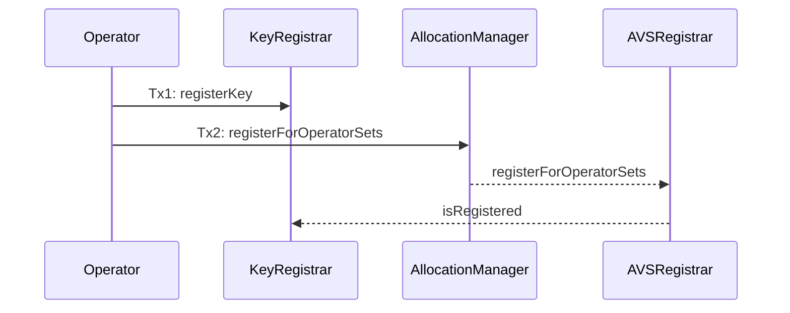
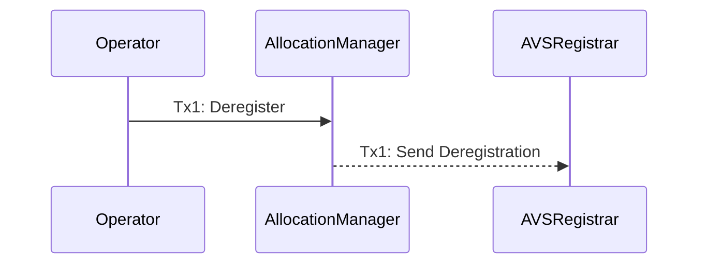
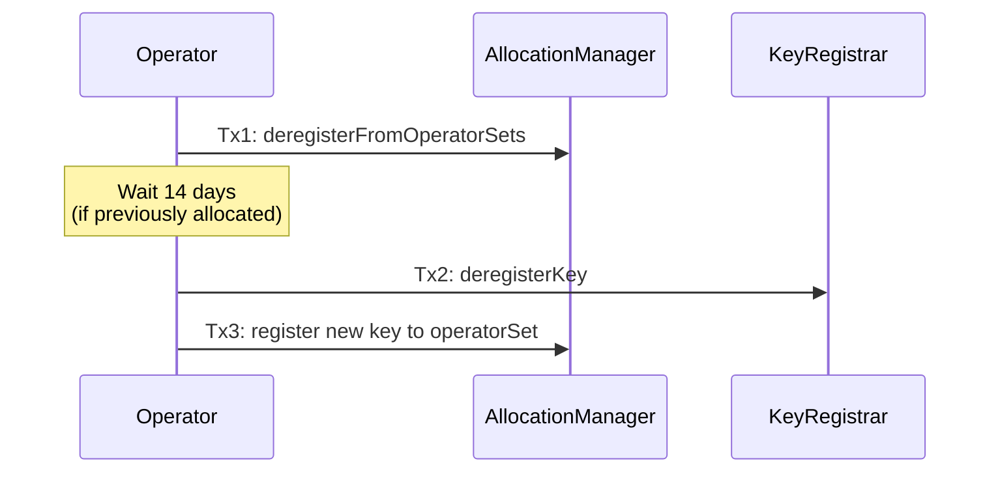

## AVSRegistrar

| File | Type | Notes |
| -------- | -------- | -------- |
| [`AVSRegistrar.sol`](../../src/middlewareV2/registrar/AVSRegistrar.sol) | Base Contract | Core registrar with hooks for extensibility |
| [`AVSRegistrarWithSocket.sol`](../../src/middlewareV2/registrar/presets/AVSRegistrarWithSocket.sol) | Preset | Adds socket URL management |
| [`AVSRegistrarWithAllowlist.sol`](../../src/middlewareV2/registrar/presets/AVSRegistrarWithAllowlist.sol) | Preset | Restricts registration to allowlisted operators |
| [`AVSRegistrarAsIdentifier.sol`](../../src/middlewareV2/registrar/presets/AVSRegistrarAsIdentifier.sol) | Preset | Serves as the AVS identifier |

Interfaces:

| File | Notes |
| -------- | -------- |
| [`IAVSRegistrar.sol`](../../lib/eigenlayer-contracts/src/contracts/interfaces/IAVSRegistrar.sol) | Main interface (in core repo) |
| [`IAVSRegistrarInternal.sol`](../../src/interfaces/IAVSRegistrarInternal.sol) | Errors and events |
| [`ISocketRegistry.sol`](../../src/interfaces/ISocketRegistryV2.sol) | Socket management interface |
| [`IAllowlist.sol`](../../src/interfaces/IAllowlist.sol) | Allowlist management interface |

---

## Overview

The AVSRegistrar is the interface between AVSs and the EigenLayer core protocol for managing operator registration. It enforces that operators have valid keys registered in the `KeyRegistrar` for a given `operatorSet` before allowing them to register. The `AVSRegistrar` manages multiple operatorSets for a single AVS.  

### Key Features

- **Access Control**: All registration/deregistration calls must originate from the `AllocationManager`
- **Key Validation**: Ensures operators have registered appropriate keys (ECDSA or BN254) for their operator sets with the [Core `KeyRegistrar`](https://github.com/Layr-Labs/eigenlayer-contracts/blob/main/docs/permissions/KeyRegistrar.md)
- **Extensibility**: Hooks: `_before/afterRegisterOperator` and `_before/AfterDeregisterOperator` enable custom logic to gate operator registration

### System Diagrams
The below system diagrams assume the *basic* interaction with the AVSRegistrar. Note that AVSs can enact more complex actions such as:

1. Ejecting operators from an operatorSet on the AllocationManager using the [Permission Controller]()
2. Propagating registration and deregistrations to external, AVS-controlled contracts
3. Gating operator registration based on custom stake-weighted parameters

#### Initialization

```mermaid
sequenceDiagram
    participant AVSAdmin as AVS Admin
    participant AVSRegistrar
    participant OperatorTableCalculator
    participant AllocationManager
    participant KeyRegistrar
    participant CrossChainRegistry

    AVS->>AVSRegistrar: Tx1: Deploy AVSRegistrar
    AVS->>AllocationManager: Tx2: updateMetadataURI()
    AVS->>AllocationManager: Tx3: setAVSRegistrar(AVSRegistrar)
    AllocationManager-->>: check supportsAVS()
    AVS->>KeyRegistrar: Tx4: configureOperatorSet(operatorSet, keyMaterial)
```

The `AVSAdmin` is the entity that conducts on-chain operations on behalf of the AVS. It can be a multisig, eoa, or governance contract. In Tx1, when the `metadataURI` is set, the identifier for the AVS in the core protocol is the address of the `AVSAdmin`. For ergonomic purposes, it is possible to have the identifier be the [`AVSRegistrar`](#avsregistrarasidentifier). See the [Core `PermissionController`](https://github.com/Layr-Labs/eigenlayer-contracts/blob/main/docs/permissions/PermissionController.md) for more information on how the admin can be changed. 

#### Registration 

All registration/deregistration will flow from the `AllocationManager`. The `middlewareV2` architecture no longer requires an AVS to deploy a `KeyRegistrar`. Instead, the `AVSRegistrar` checks key membership in the core `KeyRegistrar` contract.



#### Deregistration




#### Operator Key Rotation

Rotation takes a dependency on the `AllocationManager`. In particular, operators are only allowed to deregister their key from an operatorSet if they are not slashable by said operatorSet. 

To rotate a key, an operator must deregister from the operatorSet, wait until it is not slashable, deregister its key, and then register a new key. If the operator was not slashable, it can rotate its key without a delay. 



---

## AVSRegistrar (Base Contract)

The base `AVSRegistrar` contract validates operator key registration. It should be inherited from to build additional logic gating registration, such as [`AVSRegistrarWithSocket`](#avsregistrarwithsocket) and [`AVSRegistrarWithAllowlist](#avsregistrarwithallowlist). 

### Core Functions

#### `registerOperator`

```solidity
/**
 * @notice Called by the AllocationManager when an operator wants to register
 * for one or more operator sets
 * @param operator The registering operator
 * @param avs The AVS the operator is registering for (must match this.avs())
 * @param operatorSetIds The list of operator set ids being registered for
 * @param data Arbitrary data the operator can provide as part of registration
 * @dev This method reverts if registration is unsuccessful
 */
function registerOperator(
    address operator,
    address avs,
    uint32[] calldata operatorSetIds,
    bytes calldata data
) external virtual onlyAllocationManager;
```

Registers an operator to one or more operator sets after validating their keys.

*Effects:*
- Emits `OperatorRegistered` event

*Requirements:*
- Caller MUST be the `AllocationManager`
- Operator MUST have registered a key for the operatorSet in the `KeyRegistrar`

##### `_validateOperatorKeys`

```solidity
/**
 * @notice Validates that the operator has registered a key for the given operator sets
 * @param operator The operator to validate
 * @param operatorSetIds The operator sets to validate
 * @dev This function assumes the operator has already registered a key in the Key Registrar
 */
function _validateOperatorKeys(
    address operator,
    uint32[] calldata operatorSetIds
) internal view;
```

Ensures the operator has registered appropriate keys for all specified operator sets.

#### `deregisterOperator`

```solidity
/**
 * @notice Called by the AllocationManager when an operator is deregistered from
 * one or more operator sets. If this method reverts, it is ignored.
 * @param operator the deregistering operator
 * @param avs the AVS the operator is deregistering from. This should be the same as IAVSRegistrar.avs()
 * @param operatorSetIds the list of operator set ids being deregistered from
 */
function deregisterOperator(
    address operator,
    address avs,
    uint32[] calldata operatorSetIds
) external virtual onlyAllocationManager;
```

Deregisters an operator from one or more operator sets. This function can be called by on the `AllocationManager` by either the operator OR  the AVSs ejector if the AVS has configured permissions in the [Core `Permission Controller`](https://github.com/Layr-Labs/eigenlayer-contracts/blob/main/docs/permissions/PermissionController.md).

*Effects:*
- Emits `OperatorDeregistered` event

*Requirements:*
- Caller MUST be the `AllocationManager`

#### `supportsAVS`

```solidity
/**
 * @notice Returns true if the AVS is supported by the registrar
 * @param _avs The AVS to check
 * @return true if the AVS is supported, false otherwise
 */
function supportsAVS(
    address _avs
) public view virtual returns (bool);
```

This function is called by the `AllocationManager` to ensure that a malicious entity cannot set the AVSRegistrar that is not theirs. See [`AllocationManager.setAVSRegistrar`](https://github.com/Layr-Labs/eigenlayer-contracts/blob/main/docs/core/AllocationManager.md#setavsregistrar) for more information. 

*Returns*:
* `true` if `_avs` matches the configured AVS address
* `false` otherwise

### Hooks

The AVSRegistrar implements a hooks to add further logic to gate registration or deregistration. 

#### Hook Functions

```solidity
/**
 * @notice Hook called before the operator is registered
 * @param operator The operator to register
 * @param operatorSetIds The operator sets to register
 * @param data The data to register
 */
function _beforeRegisterOperator(
    address operator,
    uint32[] calldata operatorSetIds,
    bytes calldata data
) internal virtual {}

/**
 * @notice Hook called after the operator is registered
 * @param operator The operator to register
 * @param operatorSetIds The operator sets to register
 * @param data The data to register
 */
function _afterRegisterOperator(
    address operator,
    uint32[] calldata operatorSetIds,
    bytes calldata data
) internal virtual {}

/**
 * @notice Hook called before the operator is deregistered
 * @param operator The operator to deregister
 * @param operatorSetIds The operator sets to deregister
 */
function _beforeDeregisterOperator(
    address operator,
    uint32[] calldata operatorSetIds
) internal virtual {}

/**
 * @notice Hook called after the operator is deregistered
 * @param operator The operator to deregister
 * @param operatorSetIds The operator sets to deregister
 */
function _afterDeregisterOperator(
    address operator,
    uint32[] calldata operatorSetIds
) internal virtual {}
```

#### Hook Usage Patterns

**Before Hooks** are ideal for:
- Access control checks (e.g., allowlist verification)
- Validation of registration data
- Checking operator eligibility
- Enforcing custom requirements

**After Hooks** are ideal for:
- Storing operator metadata (e.g., socket URLs)
- Updating internal state
- Triggering external notifications
- Recording additional information

---

## AVSRegistrarWithSocket

Extends the base registrar to store a socket URL for each operator. 

The `AVSRegistrarWithSocket`: 
- Inherits from `SocketRegistry` module
- Stores socket URLs in the `_afterRegisterOperator` hook
- Allows operators to update their socket URLs post-registration

**Note: Sockets are global for the AVS and cannot be set on a per-operatorSet basis.** The socket is updated on every registration call, regardless if the operator has already registered to a different operatorSet. Sockets are *not* cleared upon deregistration. 

### Key Methods (from SocketRegistry)

#### `getOperatorSocket`

```solidity
/**
 * @notice Get the socket URL for an operator
 * @param operator The operator address
 * @return The operator's socket URL
 */
function getOperatorSocket(
    address operator
) external view returns (string memory);
```

*Returns:*
- The operator's socket URL (empty string if not set)

#### `updateSocket`

```solidity
/**
 * @notice Update the socket URL for the calling operator
 * @param operator The operator address (must be msg.sender)
 * @param socket The new socket URL
 */
function updateSocket(address operator, string memory socket) external;
```

Allows an operator to update their socket URL after registration. The operator does NOT need to be registered to update socket


*Effects:*
- Updates the stored socket URL for the operator
- Emits `OperatorSocketSet` event

*Requirements:*
- `msg.sender` MUST be the `operator`

---

## AVSRegistrarWithAllowlist

Gates registration by maintaining per-operatorSet allowlists.

The `AVSRegistrarWithAllowlist`:
- Inherits from `Allowlist` module
- Checks allowlist in the `_beforeRegisterOperator` hook
- Gates registration on allowlist membership. Deregistration can be completed regardless of allowlist membership

### Initialization

```solidity
/**
 * @notice Initialize the allowlist with an admin
 * @param admin The address that can manage the allowlist
 */
function initialize(address admin) public override initializer;
```

The admin set in this function is the owner of the contract, which gates the below `Allowlist` methods.

### Key Methods (from Allowlist)

#### `addOperatorToAllowlist`

```solidity
/**
 * @notice Add an operator to the allowlist for a specific operator set
 * @param operatorSet The operator set to update
 * @param operator The operator to add
 * @dev Only callable by owner
 */
function addOperatorToAllowlist(
    OperatorSet memory operatorSet,
    address operator
) external onlyOwner;
```

Adds an operator to the allowlist for a specific operator set, enabling them to register.

*Effects:*
- Adds operator to the allowlist for the specified operator set
- Emits `OperatorAddedToAllowlist` event

*Requirements:*
- Caller MUST be the contract owner
- Operator MUST NOT already be in the allowlist for this operator set

#### `removeOperatorFromAllowlist`

```solidity
/**
 * @notice Remove an operator from the allowlist
 * @param operatorSet The operator set to update
 * @param operator The operator to remove
 * @dev Only callable by owner
 */
function removeOperatorFromAllowlist(
    OperatorSet memory operatorSet,
    address operator
) external onlyOwner;
```

Removes an operator from the allowlist for a specific operator set.

*Effects:*
- Removes operator from the allowlist for the specified operator set
- Emits `OperatorRemovedFromAllowlist` event

*Requirements:*
- Caller MUST be the contract owner
- Operator MUST be in the allowlist for this operator set

#### `isOperatorAllowed`

```solidity
/**
 * @notice Check if an operator is allowed for a specific operator set
 * @param operatorSet The operator set to check
 * @param operator The operator to check
 * @return true if allowed, false otherwise
 */
function isOperatorAllowed(
    OperatorSet memory operatorSet,
    address operator
) public view returns (bool);
```

Checks whether an operator is on the allowlist for a specific operator set.

*Returns:*
- `true` if the operator is allowed for the operator set
- `false` otherwise

#### `getAllowedOperators`

```solidity
/**
 * @notice Get all operators on the allowlist for a specific operator set
 * @param operatorSet The operator set to query
 * @return Array of allowed operator addresses
 */
function getAllowedOperators(
    OperatorSet memory operatorSet
) external view returns (address[] memory);
```

Returns all operators currently on the allowlist for a specific operator set.

---

## AVSRegistrarAsIdentifier

A specialized registrar that makes the identifier of the AVS in the core protocol the AVSRegistrar. 

```solidity
/**
 * @notice Initialize the AVS with metadata and admin
 * @param admin The address that will control the AVS
 * @param metadataURI The metadata URI for the AVS
 */
function initialize(address admin, string memory metadataURI) public initializer;
```

*Initialization Process*:
1. Updates AVS metadata URI in the AllocationManager
2. Sets itself as the AVS registrar
3. Initiates admin transfer via PermissionController

---