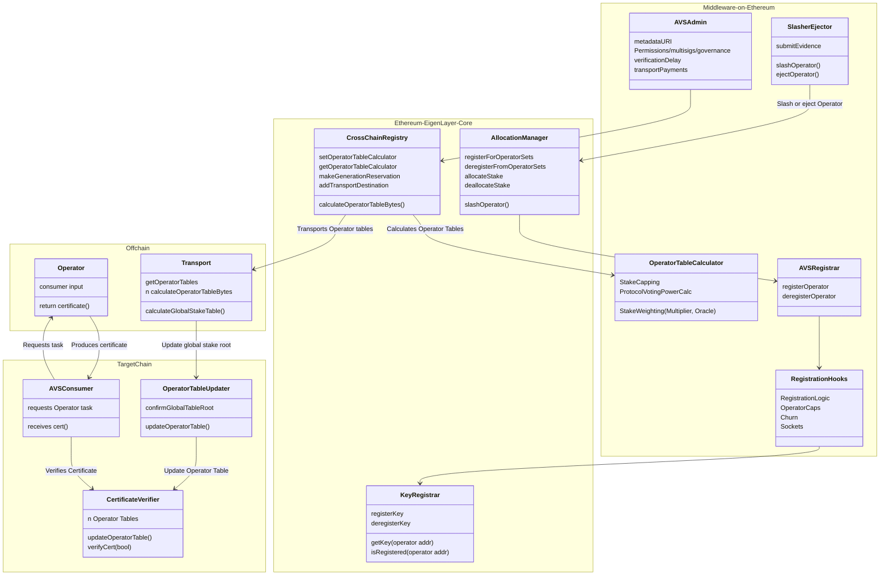

## MiddlewareV2

The middlewareV2 architecture simplifies AVS development by:
1. Utilizing core protocol contracts for operator key storage (`KeyRegistrar`) and task verification (`BN254CertificateVerifier` and `ECDSACertificateVerifier`)
2. Utilizing core contracts for OperatorSet (ie. quorum) membership and strategy composition in the `AllocationManager`
3. Utilizing the EigenLabs-run offchain services to update stakes instead of [`avs-sync`](https://github.com/Layr-Labs/avs-sync)

---

### Contents

* [System Diagram](#system-diagram)
* [AVS Registrar](#avs-registrar)
* [Operator Table Calculator](#operator-table-calculator)
    * [`ECSDATableCalculator`](#ecdsatablecalculator)
    * [`BN254TableCalculator`](#bn254tablecalculator)
* [Core Contract Integrations](#core-contract-integrations)
    * [`KeyRegistrar`](#key-registrar)
    * [`AllocationManager`](#allocation-manager)
    * [`CertificateVerifier`](#certificate-verifier)
* [Roles and Actors](#roles-and-actors)
* [Migration](#migration)

---

### System Diagram

AVS developers only have to manage deployments of the the following contracts on-chain:
- [`AVSRegistrar`](#avs-registrar)
- [`OperatorTableCalculator`](#operator-table-calculator)
- [`Slasher`](../slashing/SlasherBase.md)
- Admin Functionality
    - Rewards Submission
    - Ejection *Note: A module for programmatic ejection will be available in a future release*. 

MiddlewareV2 architecture defines standards for the `AVSRegistrar` and `OperatorTableCalculator`. 

See the [`multichain-ELIP`](https://github.com/eigenfoundation/ELIPs/blob/elip-008v1/ELIPs/ELIP-008.md) and [`core contracts documentation`](https://github.com/Layr-Labs/eigenlayer-contracts/tree/main/docs/multichain) for more information. 

---

### AVS Registrar

The AVS Registrar is the primary interface for managing operator registration and deregistration within an AVS. It integrates with core EigenLayer contracts to ensure operators have valid keys and are properly registered in operator sets.

| File | Type | Description |
| -------- | -------- | -------- |
| [`AVSRegistrar.sol`](../../src/middlewareV2/registrar/AVSRegistrar.sol) | Proxy | Core registrar contract that handles operator registration/deregistration |
| [`AVSRegistrarWithSocket.sol`](../../src/middlewareV2/registrar/presets/AVSRegistrarWithSocket.sol) | Proxy | Adds socket URL registration for operator communication |
| [`AVSRegistrarWithAllowlist.sol`](../../src/middlewareV2/registrar/presets/AVSRegistrarWithAllowlist.sol) | Proxy | Restricts registration to allowlisted operators |
| [`AVSRegistrarAsIdentifier.sol`](../../src/middlewareV2/registrar/presets/AVSRegistrarAsIdentifier.sol) | Proxy | Serves as the AVS identifier and manages permissions |

#### Base AVSRegistrar

The `AVSRegistrar` provides base functionality for AVSs to register and deregister operators to their operatorSet. A single `AVSRegistrar` supports multiple operatorSets. ***This contract expects operator registrations and deregistrations to originate from the `AllocationManager`***.

See full documentation in [`./AVSRegistrar.md`](./AVSRegistrar.md).

---

### Operator Table Calculator

| File | Type |
| -------- | -------- |
| [`BN254TableCalculatorBase.sol`](../../src/middlewareV2/tableCalculator/BN254TableCalculatorBase.sol) | Abstract Contract |
| [`BN254TableCalculator.sol`](../../src/middlewareV2/tableCalculator/BN254TableCalculator.sol) | Basic table calculator that sums slashable stake across all strategies | 
| [`ECDSATableCalculatorBase.sol`](../../src/middlewareV2/tableCalculator/ECDSATableCalculator.sol) | Abstract Contract |
| [`ECDSATableCalculator.sol`](../../src/middlewareV2/tableCalculator/ECDSATableCalculator.sol) | Basic table calculator that sums slashable stake across all strategies | 

These contracts define custom stake weights of operators in an operatorSet. They are segmented by key-type. 

See full documentation in [`/operatorTableCalculator.md`](./OperatorTableCalculator.md).

---

### Core Contract Integrations

#### Key Registrar
The `KeyRegistrar` manages cryptographic keys for operators across different operator sets. It supports both ECDSA and BN254 key types and ensures global uniqueness of keys across all operator sets.

When an operator registers to an operatorSet, the [`AVSRegistrar`](./AVSRegistrar.md) checks membership of the key in the operatorSet. 

#### Allocation Manager
The [`AllocationManager`](https://github.com/Layr-Labs/eigenlayer-contracts/blob/main/docs/core/AllocationManager.md) is the entrypoint for all operator<>avs interactions. It:

- Manages operator registration and deregistration
- Enables an AVS to configure its metadataURI and `AVSRegistrar`
- Enables an AVS to configure strategy composition in an operatorSet
- Manages allocation and deallocation of slashable stake
- Enables an AVS to slash an operator

See the [`AVSRegistrar`](./AVSRegistrar.md#system-diagrams) for how an AVS is initialized to the core protocol. 

#### Certificate Verifier
The [`CertificateVerifier`](https://github.com/Layr-Labs/eigenlayer-contracts/blob/main/docs/multichain/destination/CertificateVerifier.md) is responsible for verifying certificates from an offchain task, on-chain. The stakes in the certificate verifier are defined by the AVS-deployed `OperatorTableCalculator` and transported via an off-chain process run by Eigen labs. The `CertificateVerifier` contracts support two signature schemes: ECDSA for individual signatures and BN254 for aggregated signatures. See [multichain docs](https://github.com/Layr-Labs/eigenlayer-contracts/tree/main/docs/multichain) for more information.
